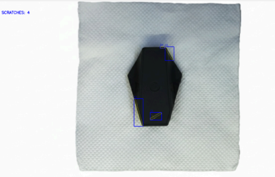
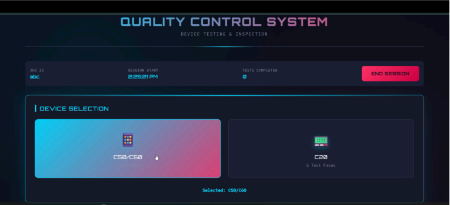

# Automated Visual Inspection System for Plastic Parts

## Overview

This project implements an automated visual inspection system for industrial plastic components using Python, OpenCV, and Flask. The system performs color deviation analysis, ROI-based inspection, and defect detection for industrial quality control applications.

---

## Features

- ROI-based precision inspection
- Color deviation detection
- Surface defect analysis
- Image preprocessing and filtering
- Flask-based backend integration
- Automated quality verification workflow

---

## Tech Stack

- Python
- OpenCV
- Flask
- NumPy
- Image Processing

---

## Project Workflow

1. Image Acquisition  
2. Image Preprocessing  
3. ROI Extraction  
4. Defect Detection  
5. Quality Verification  

---

## Folder Structure

```text
sample_inputs/      → Input inspection images
sample_outputs/     → Inspection outputs
roi_masks/          → ROI masks used for inspection
documentation/      → Internship reports and technical documents
screenshots/        → Project screenshots and outputs
```

---

## Sample Results

### ROI Detection Output


### Defect Detection Result



### Inspection Workflow



---

## Applications

- Industrial automation
- Manufacturing quality control
- Smart inspection systems
- Computer vision-based defect analysis

---

## Demo Video

[Project Demonstration](https://drive.google.com/file/d/1-dQbkcZ01rzvbfdxm--auJcwpQlHneGE/view?usp=sharing)

---

## Future Improvements

- Real-time camera integration
- AI-based defect classification
- Deep learning-based inspection models
- Industrial deployment optimization

---

## Author

Bhavya Basotia  
BS in Electronic Systems, IIT Madras
